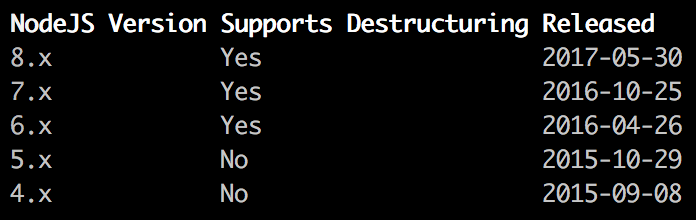

# colm
Column formatter for terminal applications _(Pronouced "column")_

## About
`colm` is a column formatter for text designed to be written to standard-out in the terminal. It came to be in light of too few options to format and align columns of text in the terminal.

## Usage
`colm` takes an array of arrays: a group of _rows_. Each row is expected to be an array of strings, which are mapped to columns. `colm` will try to adjust column widths automatically so that the text fits perfectly in the terminal, but these can be overidden.

```javascript
const formatColumns = require("colm");
const { bold } = require("chalk"); // colours and styles

console.log(formatColums([
    ["NodeJS Version",  "Supports Destructuring",   "Released"].map(bold),
    ["8.x",             "Yes",                      "2017-05-30"],
    ["7.x",             "Yes",                      "2016-10-25"],
    ["6.x",             "Yes",                      "2016-04-26"],
    ["5.x",             "No",                       "2015-10-29"],
    ["4.x",             "No",                       "2015-09-08"]
]));
```

This example results in the following table:



### Parameters and options

```javascript
formatColumns(data, options);
```

`options` is made up of the following optional properties:

 * `termWidth`: Width of the terminal (override) (columns)
 * `columnWidths`: Array of numbers representing column width overrides (all columns required if specified)
